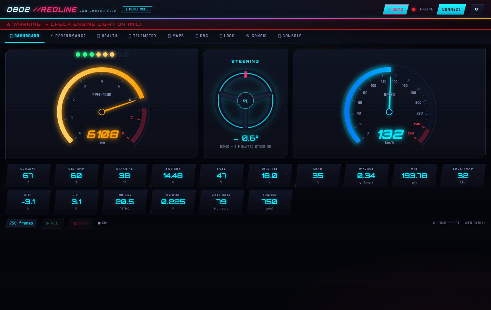
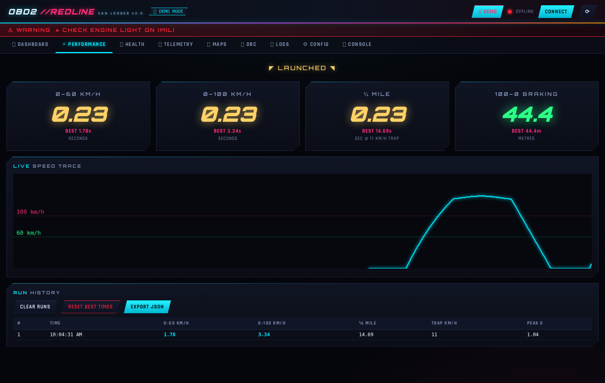
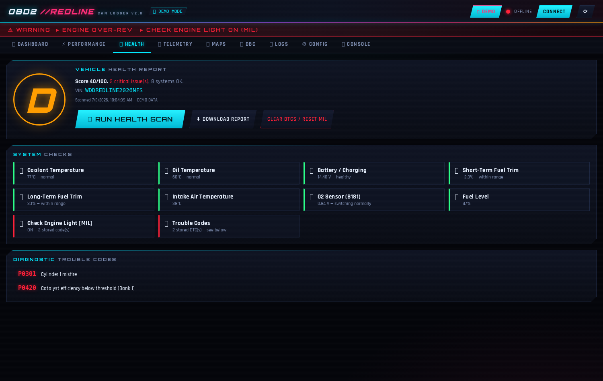
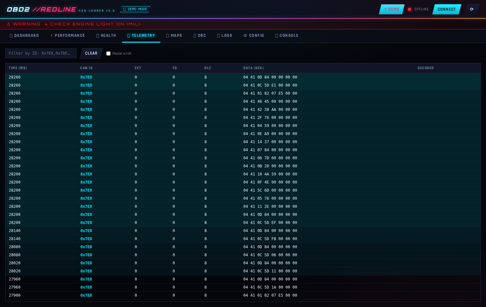

<div align="center">

# 🏁 OBD2 CAN Logger `//REDLINE`

### Turn your car's OBD2 port into a street-racing telemetry rig.

**Log every CAN frame · race the clock · read your ECU's mind — with an Adafruit Feather M4 CAN, an SD card, and a browser.**

[](https://github.com/Cr4zySh4rk/OBD2CanLogger/releases)
[](LICENSE)
[](https://developer.mozilla.org/en-US/docs/Web/API/Web_Serial_API)
[](https://www.adafruit.com/product/4759)



*No hardware? No problem — hit **🎮 Demo** and the whole dashboard runs on a simulated drive.*

</div>

---

## ⚡ What is this?

An open-source **hardware + firmware + web app** stack that plugs into any OBD2-compliant car:

- 🏁 **Race dashboard** — canvas-animated speedometer and tachometer with glowing needles, red zones, and an F1-style shift-light strip tied to a configurable redline
- ⏱️ **Performance timers** — 0–60 km/h, 0–100 km/h, ¼-mile with trap speed, 100–0 braking distance, live g-force, run history and persistent best times
- 🎡 **Steering visualization** — an on-screen wheel that turns with your real steering angle, decoded from your car's DBC signals
- 🩺 **One-click health report** — reads trouble codes, check-engine status and the VIN straight from the ECU, grades 11 systems **A–F**, and exports a styled HTML report
- 🚨 **Live warnings** — flashing alerts for coolant/oil/intake temps, battery voltage, fuel trims, over-rev, low fuel and MIL
- 💾 **Black-box logging** — every CAN frame written to SD in CSV + binary, streamed live over USB Serial
- 🗺️ **Engine-map reconstruction** — fuel trims, ignition advance, MAF, MAP, throttle vs RPM, exportable as JSON
- 📋 **DBC decoding** — drag-and-drop any `.dbc` from [opendbc](https://github.com/commaai/opendbc) to decode manufacturer-specific messages

The long game: reverse-engineer and document the factory calibration maps of any OBD2 car as a starting point for custom ECU tuning.

---

## 🖼️ Gallery

| ⚡ Performance | 🩺 Health Report |
|---|---|
|  |  |
| Launch-armed accel timers, ¼-mile, braking distance, 60-second speed trace, run history | A–F grade, 11 system checks, decoded DTCs, VIN, downloadable report |

| 📡 Telemetry |
|---|
|  |
| Raw CAN stream with live OBD2/DBC decoding and ID filtering |

---

## 🚀 Quick Start

1. **Try it right now, no hardware:** open [`webapp/index.html`](webapp/index.html) in Chrome/Edge → click **🎮 Demo**
2. **Build the logger:** flash the firmware onto a Feather M4 CAN + Adalogger wing (below), wire 3 pins to the OBD2 port
3. **Drive:** click **Connect**, pick the COM port — gauges light up, timers arm when you stop, SD logging runs in the background

---

## 🔧 Hardware

| Component | Part |
|-----------|------|
| Microcontroller | [Adafruit Feather M4 CAN Express (ATSAMD51J19A)](https://www.adafruit.com/product/4759) |
| SD card + RTC | [Adafruit Adalogger FeatherWing](https://www.adafruit.com/product/2922) |
| CAN Transceiver | **Built-in** on Feather M4 CAN — TCAN1051 on CAN1 (CANH/CANL pins exposed) |
| OBD2 Interface | OBD2 DB9/breakout cable wired to CANH/CANL |

> **Note:** The Feather M4 CAN (product 4759) has an **integrated CANFD transceiver** on CAN1. It is different from the plain Feather M4 Express (product 3857). If you have product 3857 you will need to add an MCP2515 FeatherWing.

### Wiring

```
Feather M4 CAN          OBD2 Connector (J1962)
──────────────          ──────────────────────
CANH           ────────  Pin 6  (CAN High)
CANL           ────────  Pin 14 (CAN Low)
GND            ────────  Pin 4 or 5 (Ground)
```

The Adalogger FeatherWing stacks directly on top of the Feather M4 CAN — no additional wiring needed for SD or RTC.

---

## 📁 Project Structure

```
OBD2CanLogger/
├── firmware/
│   └── OBD2CanLogger/
│       └── OBD2CanLogger.ino      # Arduino sketch for Feather M4 CAN
├── webapp/
│   └── index.html                 # Self-contained REDLINE dashboard (no server needed)
├── desktop/                       # Electron wrapper of the same dashboard
├── docs/                          # GitHub Pages copy + screenshots
├── dbc/                           # Place .dbc files here (opendbc)
└── README.md
```

---

## 💿 Firmware

### Requirements

Install via the Arduino Library Manager:

| Library | Author | Notes |
|---------|--------|-------|
| `ACANFD_FeatherM4CAN` | Pierre Molinaro | CAN/CANFD driver for the ATSAMD51 built-in controller |
| `SdFat` | Bill Greiman | SD card read/write (do **not** install "SD by Arduino") |
| `RTClib` | Adafruit | Real-time clock (PCF8523 on Adalogger) |
| `ArduinoJson` | Benoit Blanchon | v6+ — JSON serial protocol |
| `Adafruit TinyUSB Library` | Adafruit | USB Mass Storage support for SD card access over USB |

### Board Setup

1. In Arduino IDE, add Adafruit's board package URL:
   ```
   https://adafruit.github.io/arduino-board-index/package_adafruit_index.json
   ```
2. Install **Adafruit SAMD Boards** via Boards Manager
3. Select: **Adafruit Feather M4 CAN (SAMD51)**
4. Upload `firmware/OBD2CanLogger/OBD2CanLogger.ino`

### What the firmware does

- Reads `/config.json` from SD on power-up, creates timestamped session logs (`.csv` + `.can`)
- Logs **every CAN frame** to SD; streams decoded frames as JSON over USB Serial at 115200 baud
- **Two-tier OBD2 PID poller** (30 ms slot time):
  - **Fast tier (~8 Hz each):** vehicle speed + RPM — this is what makes the 0–60/0–100 timers accurate
  - **Slow tier (round-robin):** throttle, coolant, ignition advance, MAF, MAP, fuel trims, O2, load, IAT, **fuel level, battery voltage, oil temp, ambient temp, MIL status**
- **Automatic ISO-TP flow control** — answers ECU First Frames so multi-frame DTC lists and the VIN arrive complete
- Red LED heartbeat every 5 s

### SD Card Setup

The firmware requires a **FAT32-formatted SD card** (up to 32 GB; larger cards ship exFAT — reformat first).

| OS | Steps |
|----|-------|
| **macOS** | *Disk Utility* → select card → *Erase* → Format: **MS-DOS (FAT)** → Scheme: **Master Boot Record** |
| **Windows** | *File Explorer* → right-click drive → *Format* → **FAT32** _(for >32 GB use [guiformat](http://ridgecrop.co.uk/index.htm?guiformat.htm))_ |
| **Linux** | `sudo mkfs.fat -F 32 /dev/sdX1` |

> **No card inserted?** *Rec/Stop* are disabled and a red "SD: No Card" indicator appears — live streaming still works.
> **Card filling up?** Use *Config → SD Card Management → Format SD Card*, or *Enter USB Storage Mode* to mount the card as a USB drive.

### SD Card Files

| File | Description |
|------|-------------|
| `/config.json` | Device configuration (auto-created on first config command) |
| `/session_YYYYMMDD_HHMMSS.csv` | Human-readable log — one row per frame |
| `/session_YYYYMMDD_HHMMSS.can` | Binary log — 24 bytes per frame, magic header `OBD2CAN\0` |

---

## 🖥️ Web App

Open [`webapp/index.html`](webapp/index.html) in **Chrome** or **Edge** (Web Serial API required).
No server, no Node.js, no install — one self-contained HTML file.

| Tab | Description |
|-----|-------------|
| 🏁 **Dashboard** | Animated speedo + tach with configurable redline, shift-light strip, steering wheel visualization, 16 digital readouts, flashing warning banner |
| ⚡ **Performance** | 0–60 / 0–100 km/h launch timers, ¼-mile + trap speed, 100–0 braking distance, g-force, speed trace, run history, persistent best times |
| 🩺 **Health** | One-click scan → stored + pending DTCs with descriptions, MIL, VIN, 11 graded checks, downloadable HTML report, clear-DTC |
| 📡 **Telemetry** | Scrolling raw CAN frame table, ID filter, live decode column |
| 🗺️ **Maps** | Live scatter plots: TPS/RPM, fuel trim/RPM, ignition/RPM, MAF/RPM, MAP/RPM, speed/RPM. JSON export |
| 📋 **DBC** | Drag-and-drop `.dbc` decoding, built-in OBD2 PID table, steering-signal picker |
| 💾 **Logs** | Open and filter CSV logs from the SD card |
| ⚙️ **Config** | Bitrate, session name, log formats, ID filters, RTC, tach redline |
| 🖥️ **Console** | Raw JSON command terminal |

### ⏱️ How the acceleration timers work

Stop the car → timers **ARM** automatically. Floor it → launch is detected on the first speed sample above zero, and 60/100 km/h crossings are **interpolated between samples** for sub-sample accuracy (speed is polled at ~8 Hz by the firmware's fast tier). Distance is integrated for the ¼-mile; braking distance measures 100→0 km/h. Best times persist in the browser.

### 🎡 Steering visualization

Steering angle is **not a standard OBD2 PID** — it lives in manufacturer-specific CAN messages. Load your car's `.dbc` from [opendbc](https://github.com/commaai/opendbc) in the **DBC** tab and the wheel auto-binds to the first `STEER…ANGLE`-like signal (or pick any signal manually from the dropdown).

### 🚨 Warning thresholds

| Warning | Trigger |
|---------|---------|
| Engine coolant temp too high | > 105 °C |
| Engine oil temp too high | > 125 °C |
| Intake air temp high | > 65 °C |
| Battery voltage low / charging high | < 11.8 V / > 15.2 V |
| Fuel trim out of range | \|STFT\| or \|LTFT\| > 20 % |
| Engine over-rev | RPM > configured redline |
| Fuel level low | < 10 % |
| Check engine light | MIL bit from PID 0x01 |

---

## 🔌 Serial JSON Protocol

Send commands as JSON terminated by `\n`:

```jsonc
{"cmd":"status"}      // device status
{"cmd":"start"}       // start a new logging session
{"cmd":"stop"}        // stop logging
{"cmd":"config","bitrate":500000,"logcsv":true,"logbin":true,"stream":true}
{"cmd":"ls"}          // list SD files
{"cmd":"msc"}         // USB Mass Storage mode (press Reset to exit)
{"cmd":"format"}      // erase all SD log files, start fresh

// v2.0 diagnostics
{"cmd":"dtc"}         // request stored (03) + pending (07) DTCs + MIL status
{"cmd":"cleardtc"}    // clear DTCs, reset check-engine light (mode 04)
{"cmd":"vin"}         // request VIN (mode 09 PID 02, multi-frame ISO-TP)
{"cmd":"cansend","id":2015,"data":[2,1,12,0,0,0,0,0]}   // raw CAN transmit
```

Frames stream back as compact JSON:

```json
{"t":1234,"id":"0x7E8","ext":0,"fd":0,"dlc":8,"d":"04 41 0C 1A F8 00 00 00"}
```

### config.json example

```json
{
  "bitrate": 500000,
  "logcsv": true,
  "logbin": true,
  "stream": true,
  "session": "mycar",
  "filter": []
}
```

Set `"filter": [0x7E8, 0x7DF]` to only log those IDs; leave `[]` to capture everything.

---

## 📊 Map Reconstruction

The web app correlates live sensor readings into factory-map baselines:

| Map | X | Y | What it tells you |
|-----|---|---|-------------------|
| Throttle | RPM | TPS % | Throttle body characterization |
| Fuel Trim | RPM | STFT/LTFT % | How much the ECU corrects fueling |
| Ignition | RPM | Advance ° | Spark timing across the rev range |
| MAF | RPM | g/s | Airflow (volumetric-efficiency proxy) |
| MAP | RPM | kPa | Manifold vacuum / boost curve |
| Speed/RPM | RPM | km/h | Gear-ratio estimation |

**Recommended drive cycle:** cold-start idle → gentle pulls 1000–6000 RPM per gear → steady cruises (30/60/100 km/h) → overrun decel → optional WOT pull. Export JSON afterwards.

---

## 🗃️ Binary Log Format (`.can`)

8-byte magic `OBD2CAN\0`, then 24-byte records:

```
Offset  Size  Field
0       4     timestamp_ms (uint32)
4       4     id (uint32)
8       1     dlc
9       1     flags (bit0=FD, bit1=BRS, bit2=Extended)
10      2     padding
12      8     data (FD frames truncated to 8)
```

```python
import struct

with open('session.can', 'rb') as f:
    assert f.read(8) == b'OBD2CAN\x00'
    while (rec := f.read(24)) and len(rec) == 24:
        ts, id_, dlc, flags, _, _, *data = struct.unpack('<IIBB2B8B', rec)
        print(f"t={ts}ms id=0x{id_:X} dlc={dlc} data={bytes(data[:dlc]).hex()}")
```

---

## 🗺️ Roadmap

- [x] OBD2 PID poller (two-tier fast/slow schedule)
- [x] DTC read/clear + graded health report
- [x] Acceleration timers (0–60, 0–100, ¼ mile) + braking distance
- [x] Steering-angle visualization from DBC signals
- [x] Demo mode (full simulated drive, zero hardware)
- [ ] 3D surface map visualization (RPM × Load → value)
- [ ] Compare two log sessions side-by-side
- [ ] Export maps to CSV / MegaTune format
- [ ] Automatic gear detection from speed/RPM ratio
- [ ] CANFD full 64-byte data logging
- [ ] Wi-Fi streaming (ESP32 co-processor or Feather variant)
- [ ] opendbc fingerprinting (auto-identify car model from CAN traffic)

---

## 🙌 Credits & References

- [ACANFD_FeatherM4CAN](https://github.com/pierremolinaro/acanfd-feather-m4-can) — Pierre Molinaro — CAN driver
- [opendbc](https://github.com/commaai/opendbc) — comma.ai — DBC database & car CAN decoding
- [Adafruit Feather M4 CAN](https://learn.adafruit.com/adafruit-feather-m4-can-express) — hardware documentation
- Need for Speed / Betaflight Configurator — UI inspiration

## ⚠️ Disclaimer

Performance timing and diagnostics are for **closed-course / informational use**. Don't race on public roads, and don't treat the health report as a substitute for a professional inspection.

## 📄 License

MIT — see [LICENSE](LICENSE)
